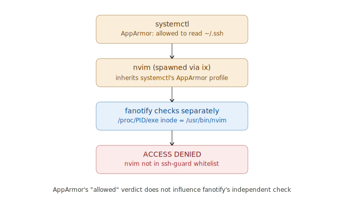

# SSH-Guard: Arch Linux Supply Chain System Hardening Guide

> [!NOTE]
> WIP attempt, be careful.

Supply Chain Attacks are very annoying. This setup aims to protect at least the most sensitive key files allowing only whitelisted binaries to access those sensitive files.

As shown in this example, only `ssh` along with `ssh-agent`and family and `git` will be allowed to access the `~/.ssh` by the user.

Update directories and files to protect them accordingly. Do not rely on recursiveness. Add one directory at a time to protect in configs.

> [!WARNING]
> Arch's default linux kernel ships with AppArmor and fanotify all enabled. SELinux requires the linux-hardened package instead. This setup should work also on other Linux distros but some additional packages and system configuration may be needed to change.

> [!WARNING]
> This procedure tries to protect sensitive directories running with normal user privileges.
> If you run everything as root (and you definitely shouldn't), this setup is completely useless.

# High-level description


To achieve the goal, we will enforce some rules using `MAC` (Mandatory Access Control) rules using AppArmor.
By default, Linux for user role permission management uses the `DAC` (Discretionary Access Control), which allows the transfer of user permission to other users via the usual `Owner-Group-Other` policy management. 

It is very handy but unsafe sometimes. 

On the other hand, `MAC` policies define static rules and tag labels where processes, users and objects must adhere in order to access other processes, users, and objects. Applying a whole `MAC` to the entire Linux filesystem could be a pain to handle, but targeting only some sensitive files that rarely should be accessible by the user themselves can be a great improvement from a security point of view. Also, if you use `SELinux`, you probably don't even need `apparmor` because, as far as I know, you should be able to obtain a similar behaviour on the permissions of files via `ACL` (Access Control List) management rather than traditional `DAC`, by using the built-in available commands `setfacl` and `getfacl`.

As shwon in the image:

- The `MAC` policy allow **WHAT the binary (`git` and `ssh` here) is allowed to access (paths, caps, network)**
- The fanotify daemon allows to check **WHO is allowed to access ~/.ssh**

You can get inspiration from this basic guide, add to the setup your own directories which contain `tokens`, `keys`, and other sensitive data but remember that if the whitelisted application allow to read them, this can become useless as such binaries can be used to bypass restrictions and read the content of the files. For example you should not whitelist application which allow to execute commands or contain built-in self readers such like `more`, `less`, `cat` and so on. 

This underlines why the `AppArmor` profiles alone are not enough.
In fact assuming to rely entirely on `AppArmor` profiles we could have a situation like this:

The `systemctl` is whitelisted and it can be used to read a file and then it can be used by the user normally for bypassing `MAC`rules usin ghe pager:

```bash
systemctl

# prompt:
#! /bin/usr/nvim /path/of/protected/file

# or
# :r ~/.ssh/id_ed25519
```



The purpose of fanotify layer is for reducing the possibility of `pager shell-escape` like the situation described above. It independently checks `/proc/<PID>/exe` of the process that issued the open(). When `less/nvim` shell-escapes to cat, that cat process has `/proc/PID/exe` -> `/usr/bin/cat`. Unless cat is also in `ssh-guard.conf` [allow], fanotify denies the open with `EPERM` -- regardless of what AppArmor permitted upstream.

# Setup

## 1. AppArmor (enable at boot)

```bash
sudo pacman -S apparmor

# Add to /etc/default/grub --- inside GRUB_CMDLINE_LINUX:
#   apparmor=1 security=apparmor

sudo grub-mkconfig -o /boot/grub/grub.cfg
sudo reboot
```

After reboot:

```bash
sudo systemctl enable --now apparmor
aa-status   # should show "apparmor module is loaded"
```

> [!IMPORTANT]  
> If you meet the message `apparmor filesystem is not mounted.` by running `aa-status`, you probably installed `arch linux` using `archinstall >= 2.7`. `Archinstall 2.7` added Unified Kernel Image support (https://www.phoronix.com/news/Arch-Linux-Archinstall-2.7) so updating the `GRUB_CMDLINE_LINUX` is not enough. You can find the fix in the document [UKI-BASED-INSTALLS.md](./uki-based-installs.md)


## 2. Install AppArmor profiles

```bash
sudo cp apparmor-usr.bin.ssh /etc/apparmor.d/usr.bin.ssh
sudo cp apparmor-usr.bin.git /etc/apparmor.d/usr.bin.git

# Load in COMPLAIN mode first --- logs denials without blocking
sudo apparmor_parser -r /etc/apparmor.d/usr.bin.ssh
sudo apparmor_parser -r /etc/apparmor.d/usr.bin.git
sudo aa-complain /usr/bin/ssh /usr/bin/git
```

> [!IMPORTANT]
> You need to record your activities on the target binaries for a week (or more if you want).
> 
> Why this is important? Jumping straight to enforce mode risks silently or loudly breaking your git/ssh workflows the moment the profile encounters something I didn't anticipate -- and hand-written profiles (even careful ones) almost always have gaps, because what a binary actually touches depends heavily on your specific usage patterns, not just the binary's source code. The "trial period" ensures to capture missing behaviours from the profile. This adapts your custom usages/configurations on top of mine.

Optionally check logs before enforcing:

```bash
sudo pamcan -S audit
sudo systemctl enable --now auditd
sudo aa-logprof   # interactive: review and tune before enforcing
journalctl -f | grep -i apparmor
```

Enforce:

```bash
# After a week of clean logs, enforce:
sudo aa-enforce /usr/bin/ssh /usr/bin/git
```

## 3. Build and install the fanotify daemon

```bash
sudo pacman -S --needed gcc
sudo gcc -O2 -Wall -Wextra -o /usr/local/sbin/ssh-guard scripts/ssh-guard-c/ssh-guard.c

# OR compile the go-version, you need go installed at least 1.26
# this conversion has been done because i did not checked carefully the c script, and the c-version if contains memory corruption vulnerabilities can be exploited for privilege escalation tenchiques
# use a memory-safe language should prevent this

cd scripts/ssh-guard-go
go mod download && go mod verify && go mod tidy
sudo go build -ldflags="-s -w" -o /usr/local/sbin/ssh-guard ssh-guard.go
cd ../../

sudo chmod 700 /usr/local/sbin/ssh-guard
```

Edit the config and replace `alice` with your username

```bash
sudo mkdir -p /etc/ssh-guard
sudo cp ssh-guard.conf /etc/ssh-guard/config
sudo chmod 600 /etc/ssh-guard/config
sudo nano /etc/ssh-guard/config
```

Test manually if everything works (runs in foreground, logs to stderr):

```bash
sudo /usr/local/sbin/ssh-guard

# In another terminal --- this should work:
ssh-add -l
git status

# This should be DENIED (not in whitelist):
sudo -u ${USER} $ cat /home/alice/.ssh/id_ed25519   # denied if cat not in allow list
```

If you get blocked trying to read a key in `~/ssh` but `ssh-add -l` gave no problem you can proceed with next step.

## 4. Install as a systemd service

```bash
sudo cp ssh-guard.service /etc/systemd/system/
sudo systemctl daemon-reload
sudo systemctl enable --now ssh-guard

# first running check:
ps aux | grep -i ssh-guard

# Live log:
journalctl -u ssh-guard -f
```

If it works:

```bash
cat ~/.ssh/github

Jun 13 18:06:46 red-fox-19291 ssh-guard[1145975]: DENIED access tracking -> pid=1149950 exe=/usr/bin/cat dev=64768 ino=45627653
```

> [!WARNING]
> If you need to disable the guard for some reason and access `~/.git` normally from the user you can stop the process temporarly by doing `sudo systemctl stop ssh-guard`
> 
> It will be back up and running by rebooting or with `sudo systemctl start ssh-guard`.

## 5. Step 5: Pacman hook (critical for updates)

```bash
sudo mkdir -p /etc/pacman.d/hooks
sudo cp 50-ssh-guard-reload.hook /etc/pacman.d/hooks/
```

This hook triggers after any openssh or git package update and sends SIGHUP to the daemon. The daemon flushes its inode cache and re-reads `/etc/ssh-guard/`config, resolving the fresh inodes of the newly installed binaries. Without this, updated binaries get denied until you manually reload.

You can also reload at any time yourself:

```bash
sudo systemctl kill -s HUP ssh-guard
# or: sudo kill -HUP $(cat /run/ssh-guard.pid)
```

### Notes

Scripts have been generated using `Claude.ai`