# SSH-Guard: Arch Linux Supply Chain System Hardening Guide

> [!NOTE]
> WIP attempt, it may cause permission problems.

Supply Chain Attacks are very annoying. This setup aims to protect at least the most sensitive key files allowing only whitelisted binaries to access those sensitive files.

As shown in this example, only `ssh` along with `ssh-agent`and family and `git` will be allowed to access the `~/.ssh` by the user.

Update directories and files to protect them accordingly. Do not rely on recursiveness. Add one directory at a time to protect in configs.

> [!WARNING]
> Arch's default linux kernel ships with AppArmor and fanotify all enabled. SELinux requires the linux-hardened package instead. This setup should work also on other Linux distros but some additional packages and system configuration may be needed to change.

> [!WARNING]
> This procedure tries to protect sensitive directories running with normal user privileges.
> If you run everything as root (and you definitely shouldn't), this setup is completely useless.

# High-level description



graph TD
    A[git / ssh] -->|Initiates Request| B[AppArmor profile]
    subgraph "Execution Context"
        B -->|Checks Permissions| C{What binary is allowed to access?}
        C -->|Validates Paths/Caps/Network| D[fanotify daemon]
    end
    D -->|Inode-verified whitelist| E[~/.ssh protected]

    style B fill:#f9f,stroke:#333,stroke-width:2px
    style D fill:#bbf,stroke:#333,stroke-width:2px
    style E fill:#dfd,stroke:#333,stroke-width:2px

# Setup

1. AppArmor (enable at boot)

```bash
sudo pacman -S apparmor

# Add to /etc/default/grub --- inside GRUB_CMDLINE_LINUX:
#   apparmor=1 security=apparmor

sudo grub-mkconfig -o /boot/grub/grub.cfg
sudo reboot
```

After reboot:

```bash
sudo systemctl enable --now apparmor
aa-status   # should show "apparmor module is loaded"
```

2. Install AppArmor profiles

```bash
sudo cp apparmor-usr.bin.ssh /etc/apparmor.d/usr.bin.ssh
sudo cp apparmor-usr.bin.git /etc/apparmor.d/usr.bin.git

# Load in COMPLAIN mode first --- logs denials without blocking
sudo apparmor_parser -r /etc/apparmor.d/usr.bin.ssh
sudo apparmor_parser -r /etc/apparmor.d/usr.bin.git
sudo aa-complain /usr/bin/ssh /usr/bin/git
```

> [!IMPORTANT]
> You need to record your activities on the target directories for a week (or more if you want)

```bash
# After a week of clean logs, enforce:
# sudo aa-enforce /usr/bin/ssh /usr/bin/git
```

Optionally check logs before enforcing:


```bash
sudo aa-logprof   # interactive: review and tune before enforcing
journalctl -f | grep -i apparmor
```

3. Build and install the fanotify daemon

```bash
sudo pacman -S --needed gcc
sudo gcc -O2 -Wall -Wextra -o /usr/local/sbin/ssh-guard scripts/ssh-guard.c

# OR compile the go-version
cd scripts
go mod download && go mod verify && go mod tidy
cd scripts
sudo go build -ldflags="-s -w" -o /usr/local/sbin/ssh-guard ssh-guard.go
cd ..

sudo chmod 700 /usr/local/sbin/ssh-guard
```

Edit the config and replace `alice` with your username

```bash
sudo mkdir -p /etc/ssh-guard
sudo cp ssh-guard.conf /etc/ssh-guard/config
sudo chmod 600 /etc/ssh-guard/config
sudo nano /etc/ssh-guard/config
```

Test manually if everything works (runs in foreground, logs to stderr):

```bash
sudo /usr/local/sbin/ssh-guard

# In another terminal --- this should work:
ssh-add -l
git status

# This should be DENIED (not in whitelist):
sudo -u ${USER} $ cat /home/alice/.ssh/id_ed25519   # denied if cat not in allow list
```

If you get blocked trying to read a key in `~/ssh` but `ssh-add -l` gave no problem you can proceed with next step.

4. Install as a systemd service

```bash
sudo cp ssh-guard.service /etc/systemd/system/
sudo systemctl daemon-reload
sudo systemctl enable --now ssh-guard

first running check:
ps aux | grep -i ssh-guard

# Live log:
journalctl -u ssh-guard -f
```

If it works:

```bash
cat ~/.ssh/github

Jun 13 18:06:46 red-fox-19291 ssh-guard[1145975]: DENIED access tracking -> pid=1149950 exe=/usr/bin/cat dev=64768 ino=45627653
```

> [!WARNING]
> If you need to disable the guard for some reason and access `~/.git` you can kill the process temporarly by doing
> `sudo pkill ssh-guard`
> It will be back up and running by rebooting or with `sudo systemctl start ssh-guard`.

5. Step 5 --- Pacman hook (critical for updates)

```bash
sudo mkdir -p /etc/pacman.d/hooks
sudo cp 50-ssh-guard-reload.hook /etc/pacman.d/hooks/
```

This hook triggers after any openssh or git package update and sends SIGHUP to the daemon. The daemon flushes its inode cache and re-reads `/etc/ssh-guard/`config, resolving the fresh inodes of the newly installed binaries. Without this, updated binaries get denied until you manually reload.

You can also reload at any time yourself:

```bash
sudo systemctl kill -s HUP ssh-guard
# or: sudo kill -HUP $(cat /run/ssh-guard.pid)
```

### Ssh-guard.c notes

The identity check in `is_allowed`() uses open("/proc/PID/exe", O_PATH) followed by `fstat()` on that file descriptor rather than readlink + stat. The `O_PATH` flag is important: it opens a reference to the kernel's dentry for the binary without reading or executing anything, and the kernel holds that reference across the `fstat()` call. This makes it TOCTOU-resistant --- if an attacker races to replace the binary between the readlink and the stat, we still get the inode of what the kernel believes is running, not what's on disk at that moment.

On `SIGHUP`, the daemon calls `fanotify_mark(fd, FAN_MARK_FLUSH, ...)` which atomically removes all inode marks, then re-adds them after re-reading the config. Pending permission events already in the kernel queue are answered with the old whitelist before the flush, so there's no window where legitimate access is dropped mid-operation.

The `FAN_EVENT_ON_CHILD` flag on the directory mark is what generates events for files inside `~/.ssh` --- without it, only the directory inode itself would be covered. Since `~/.ssh` is typically flat (no subdirs), this covers all key files and config.

### Notes

Scripts have been generated using `Claude.ai`